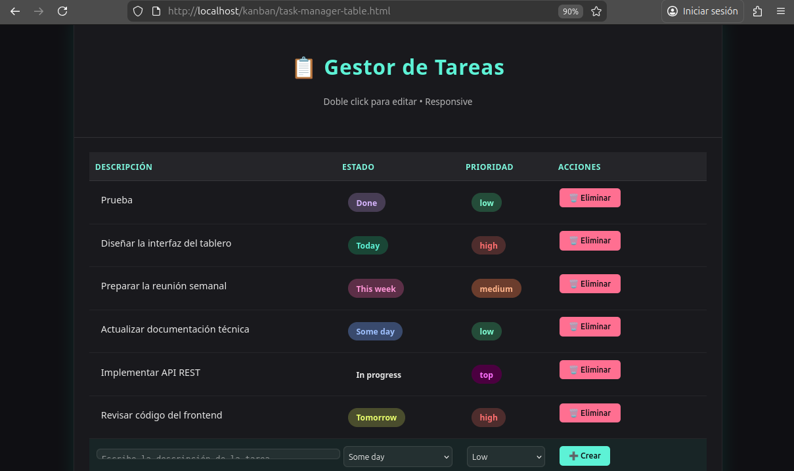

# Sistema de Gestión Kanban

## Proyecto Interdisciplinar · Diseño de Interfaces Web (DIW)

### Descripción
- Aplicación web tipo Kanban para gestionar tareas (CRUD) con persistencia MySQL y API REST en PHP.
- Interfaz responsive, drag & drop y filtrado/búsqueda de tareas.

### Características principales
- Crear, editar y eliminar tareas.
- Columnas por defecto: `Por Hacer` (todo), `En Progreso` (in_progress), `Terminado` (done).
- Arrastrar y soltar tareas entre columnas (drag & drop).
- Prioridad (Alta, Media, Baja), fecha de creación y etiquetas opcionales.
- Filtrado por prioridad, etiquetas y búsqueda por texto.
- Contador de tareas por columna.

### Tecnologías
- Frontend: HTML5, CSS3, JavaScript (ES6+).
- Backend: PHP 7.4+.
- Base de datos: MySQL.

### Estructura del proyecto (carpeta `kanban`)
- `index.html` - entrada principal del tablero (interfaz cliente).
- `css/` - estilos (`styles.css`, `responsive.css`).
- `js/kanban.js` - lógica frontend y cliente para la API.
- `php/config/database.php` - configuración de conexión a la base de datos.
- `php/api/tasks.php` - API REST para gestionar tareas (endpoints CRUD).
- `php/models/`, `php/controllers/` - modelos y controladores (placeholders para MVC).
- `sql/database.sql` - script para crear la base de datos y tablas.
- `package.json` - (opcional, para herramientas de desarrollo).

### Instalación rápida (entorno de desarrollo)
1. Requisitos previos
   - PHP 7.4 o superior instalado.
   - MySQL (o MariaDB) operativo.
   - Opcional: Composer, Node.js para herramientas de frontend.

2. Importar la base de datos
   - Usando MySQL Workbench, phpMyAdmin o la línea de comandos, importar `sql/database.sql`:

     PS> cd "C:\Users\AIRI\OneDrive\Documents\DAW_2\PIM\Proyecto2\kanban"
     PS> mysql -u tu_usuario -p < sql\database.sql

   - Si usas `phpMyAdmin`, sube/importa `sql/database.sql` desde la interfaz.

3. Configurar conexión a la base de datos
  - Edita `php/config/database.php` y configura las credenciales (host, usuario, contraseña, nombre de BD). Ejemplo:

```php
<?php
$db_host = '127.0.0.1';
$db_name = 'kanban_db';
$db_user = 'kanban_user';
$db_pass = 'tu_contraseña';

try {
    $pdo = new PDO("mysql:host=$db_host;dbname=$db_name;charset=utf8", $db_user, $db_pass);
    $pdo->setAttribute(PDO::ATTR_ERRMODE, PDO::ERRMODE_EXCEPTION);
} catch (PDOException $e) {
    die('DB Connection failed: ' . $e->getMessage());
}
```

4. Levantar servidor de desarrollo (opcional, usando PHP integrado)
   - Desde PowerShell, sitúate en la carpeta `kanban` y lanza el servidor:

     PS> cd "C:\ruta\del\proyecto"

     PS> php -S localhost:8000

   - Abre el navegador en `http://localhost:8000/index.html`.

### API REST
- Endpoint base (archivo): `php/api/tasks.php`.
- Endpoints esperados:
  - `GET /php/api/tasks.php` → obtener todas las tareas (JSON).
  - `POST /php/api/tasks.php` → crear nueva tarea (body JSON / form-data).
  - `PUT /php/api/tasks.php?id={id}` → actualizar tarea completa.
  - `PATCH /php/api/tasks.php?id={id}` → actualizar solo estado (por ejemplo al arrastrar).
  - `DELETE /php/api/tasks.php?id={id}` → eliminar tarea.

### Ejemplos de uso (curl / PowerShell)
- Obtener tareas (curl):

  curl -X GET "http://localhost:8000/php/api/tasks.php"

- Crear tarea (cURL JSON):

  curl -X POST "http://localhost:8000/php/api/tasks.php" -H "Content-Type: application/json" -d '{"description":"Tarea de prueba","priority":"high","status":"Today"}'

- Actualizar estado (PowerShell):

  $body = @{ status = 'in_progress' } | ConvertTo-Json
  Invoke-RestMethod -Uri "http://localhost:8000/php/api/tasks.php?id=1" -Method PATCH -Body $body -ContentType 'application/json'

### Consideraciones de diseño
- Arquitectura: sigue el patrón MVC sugerido (separar `models`, `controllers`, `api` y `config`).
- UX: uso de colores para prioridades y animaciones suaves para drag & drop.
- Accesibilidad básica: contraste, foco visible y navegación por teclado.

### Extensiones y mejoras propuestas
- Integrar autenticación (usuarios) y asignación de tareas.
- Añadir fecha límite y notificaciones visuales.
- Registrar historial de cambios (auditoría).
- Exportar tareas a CSV/PDF y modo claro/oscuro.

### Pruebas


### Archivos relevantes
- `sql/database.sql` → script DB inicial.
- `php/config/database.php` → configuración de conexión.
- `php/api/tasks.php` → API REST.
- `index.html`, `js/kanban.js` → interfaz / lógica frontend.

### Contacto
- Autor: Iván Espí Asins
- Curso: DAW - Diseño de Interfaces Web